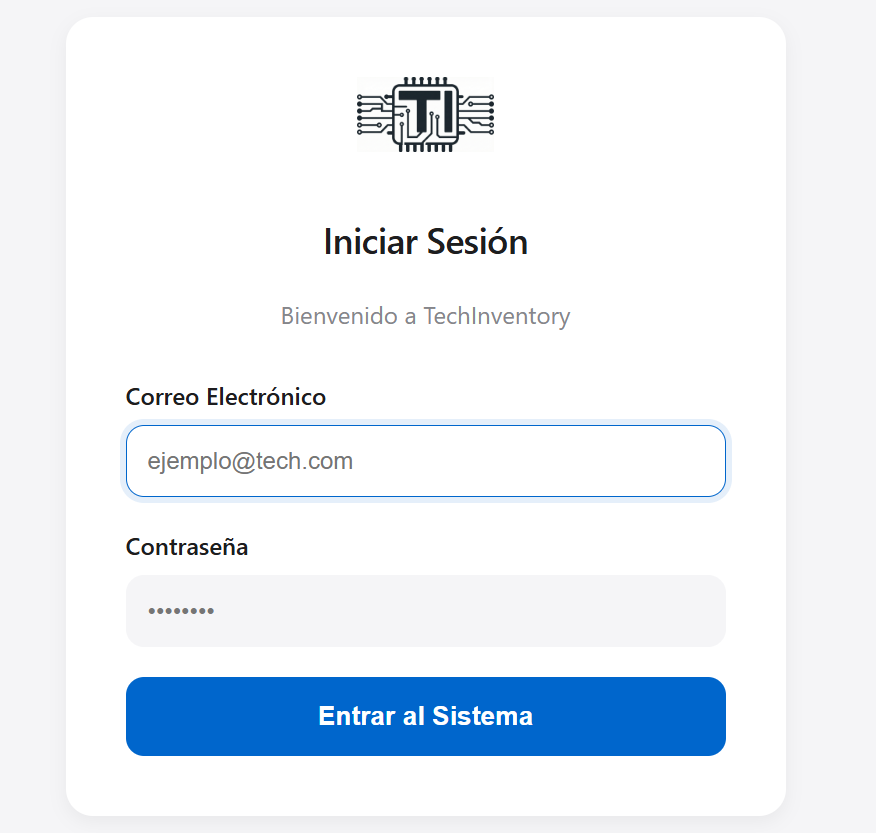
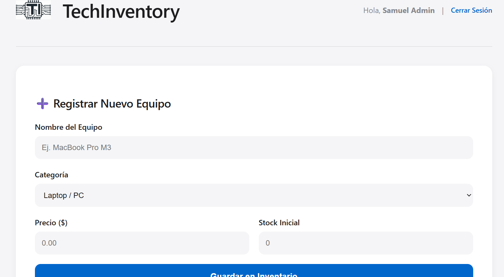

# ⚡ TechInventory System 


Sistema de gestión de inventarios empresariales **Full Stack**. Esta versión incluye autenticación segura, arquitectura MVC y una interfaz gráfica minimalista.

---

## 📸 Galería del Proyecto

| 🔐 Login | 📊 Dashboard Principal | 📈 Detalles / Stock |
| :---: | :---: | :---: |
|  |  |  |

---

## 📂 Estructura del Proyecto

Aquí te explico qué hace cada archivo clave en el sistema:

| Archivo / Carpeta | Descripción |
| :--- | :--- |
| **`app.py`** | 🧠 **El Cerebro (Backend):** Controla el servidor Flask, maneja las rutas, la seguridad del login y conecta con la base de datos. |
| **`templates/`** | 🖼️ **Vistas (HTML):** Contiene las páginas web (`index.html`, `login.html`) que ve el usuario. Usamos Jinja2 para inyectar datos. |
| **`static/css/`** | 🎨 **Estilos:** Aquí vive `styles.css` con el diseño minimalista inspirado en Apple. |
| **`static/js/`** | ⚡ **Lógica Cliente:** El archivo `app.js` maneja la interactividad (AJAX) para guardar productos sin recargar la página. |
| **`static/images/`** | 📷 **Assets:** Aquí guardamos el logo y otros recursos gráficos. |
| **`db.sql`** | 🗄️ **Base de Datos:** Script SQL para crear las tablas `usuarios` y `productos` automáticamente. |
| **`.gitignore`** | 🛡️ **Escudo:** Le dice a Git qué archivos "basura" ignorar (como carpetas de entorno virtual). |

---

## 🚀 Instalación Rápida

1.  **Clonar repositorio:**
    ```bash
    git clone https://github.com/SAMUELMARTINEZ8/TechInventory-System.git
    ```
2.  **Instalar dependencias:**
    ```bash
    pip install flask mysql-connector-python werkzeug
    ```
3.  **Configurar Base de Datos:**
    * Importar `db.sql` en tu gestor MySQL.
    * Crear usuario administrador (ver documentación interna en `app.py`).
4.  **Ejecutar:**
    ```bash
    python app.py
    ```

---
*Desarrollado por Samuel Martinez* 🐵